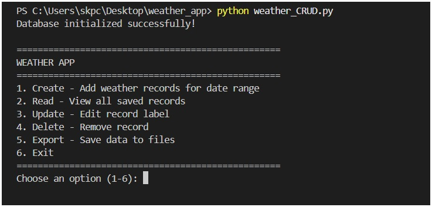

# WeatherApp Project

This repository contains two main components: a **Flask-based Weather API** for fetching live weather data and a **SQLite CRUD Terminal App** for managing a local database of weather query records.

---

### Features

#### Weather App
-   **Fetches Current & Forecast Data**: Retrieves real-time weather and a 5-day forecast from the **OpenWeatherMap API**.
-   **Flexible Location Input**: Supports fetching weather by **city name**, **geographic coordinates**, or **ZIP code**.
-   **Unit Support**: Handles **metric**, **imperial** units.
-   **Weather Information**: Provides detailed data including temperature, humidity, wind speed, pressure, sunrise/sunset times, and weather descriptions.
-   **Error Handling**: Gracefully handles invalid inputs and API errors.

#### Database Operations
-   **Local Database Management**: Uses a local SQLite database to store weather query records.
-   **Full CRUD Operations**: Supports **Create, Read, Update, and Delete** operations for managing records.
-   **Data Export**: Allows exporting database records to **JSON** or **CSV** formats for backup and analysis.
-   **Structured Schema**: Maintains a consistent database schema for all stored weather data.

---

### Setup

#### Prerequisites
-   **Python 3.7+**
-   **SQLite3** (typically included with Python)
-   An **OpenWeatherMap API Key** (you can get one from their website).

#### Installation
1.  Clone the repository:
    ```bash
    git clone [https://github.com/st4282/WeatherApp.git](https://github.com/st4282/WeatherApp.git)
    cd WeatherApp
    ```
2.  Install the required Python packages:
    ```bash
    pip install flask requests python-dotenv
    ```

---

### Usage

#### 1. Weather App
1.  **Set up the API key**: Create a file named `.env` in your Flask app's directory and add your OpenWeatherMap key:
    ```
    OPENWEATHER_API_KEY=your_api_key_here
    ```

2.  **Run the application**:
    ```bash
    python app.py
    ```
    The server will start at `http://127.0.0.1:5000/`. You can use the web interface or send `POST` requests to the `/weather` endpoint.

3.  **Example API Request**:
    ```json
    # By City Name
    {
      "location": "New York",
      "units": "metric"
    }

    # By Coordinates
    {
      "lat": 40.7128,
      "lon": -74.0060,
      "units": "imperial"
    }
    ```

#### 2. Database Operations
1.  **Initialize the database**: Run the script to create the `weather_records` table:
    ```bash
    python weather_db.py
    ```

2.  **Perform CRUD operations**: Import and use the functions (`create_weather_record`, `read_all_records`, etc.) in your own Python scripts or in a Python REPL.



---

### API Reference

**`POST /weather`**
-   **Parameters**:
    -   `units` (string): `"metric"`, `"imperial"`(default: `"metric"`)
    -   `location` (string): City name (e.g., `"New York"`)
    -    OR
    -   `lat` (float): Latitude coordinate
    -   `lon` (float): Longitude coordinate
    -    OR
    -   `zip` (string): ZIP code
    -   `country` (string): Country code (e.g., `"us"`)
-   **Response**: A JSON object with weather details.

#### Notes
The app supports weather data queries for up to 5 days due to API limitations.

---

### Database Schema

Table: `weather_records`

| Column         | Type    | Description                                   |
|----------------|---------|-----------------------------------------------|
| `id`           | INTEGER | Primary key, auto-incremented                 |
| `label`        | TEXT    | User-defined label for the record             |
| `location_type`| TEXT    | Type of location input (e.g., `"city"`)       |
| `location`     | TEXT    | Location string (e.g., `"New York, US"`)      |
| `start_date`   | TEXT    | Start date for record (ISO format)            |
| `end_date`     | TEXT    | End date for record (ISO format)              |
| `temp`         | REAL    | Current temperature                           |
| `temp_min`     | REAL    | Minimum temperature                           |
| `temp_max`     | REAL    | Maximum temperature                           |
| `feels_like`   | REAL    | "Feels like" temperature                      |
| `description`  | TEXT    | Weather description (e.g., `"clear sky"`)     |
| `local_time`   | TEXT    | Local timestamp                               |
| `weather_icon` | TEXT    | Weather icon code                             |
| `created_at`   | TEXT    | Timestamp record was created                  |
| `updated_at`   | TEXT    | Timestamp record was last updated             |

---

### Exporting Data

You can easily export your data to a JSON OR CSV file

### License

MIT License
